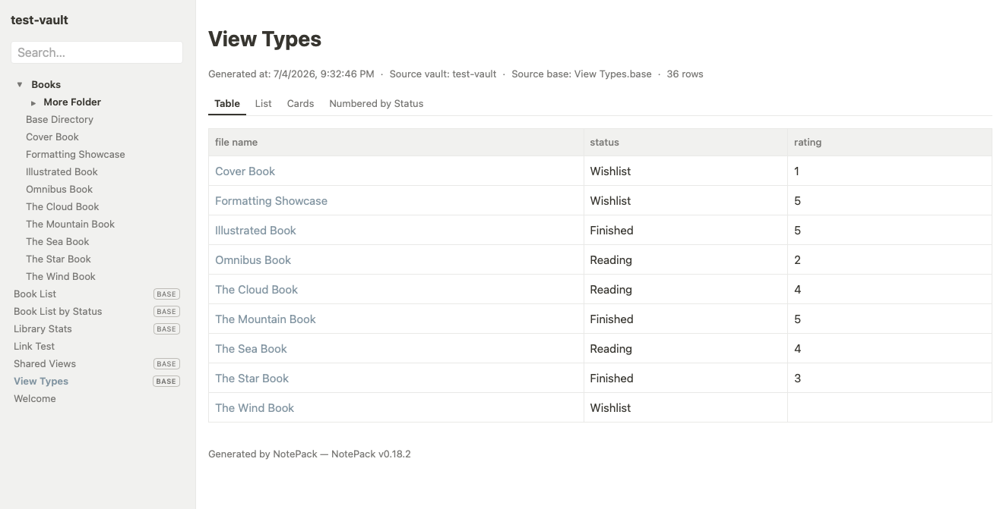
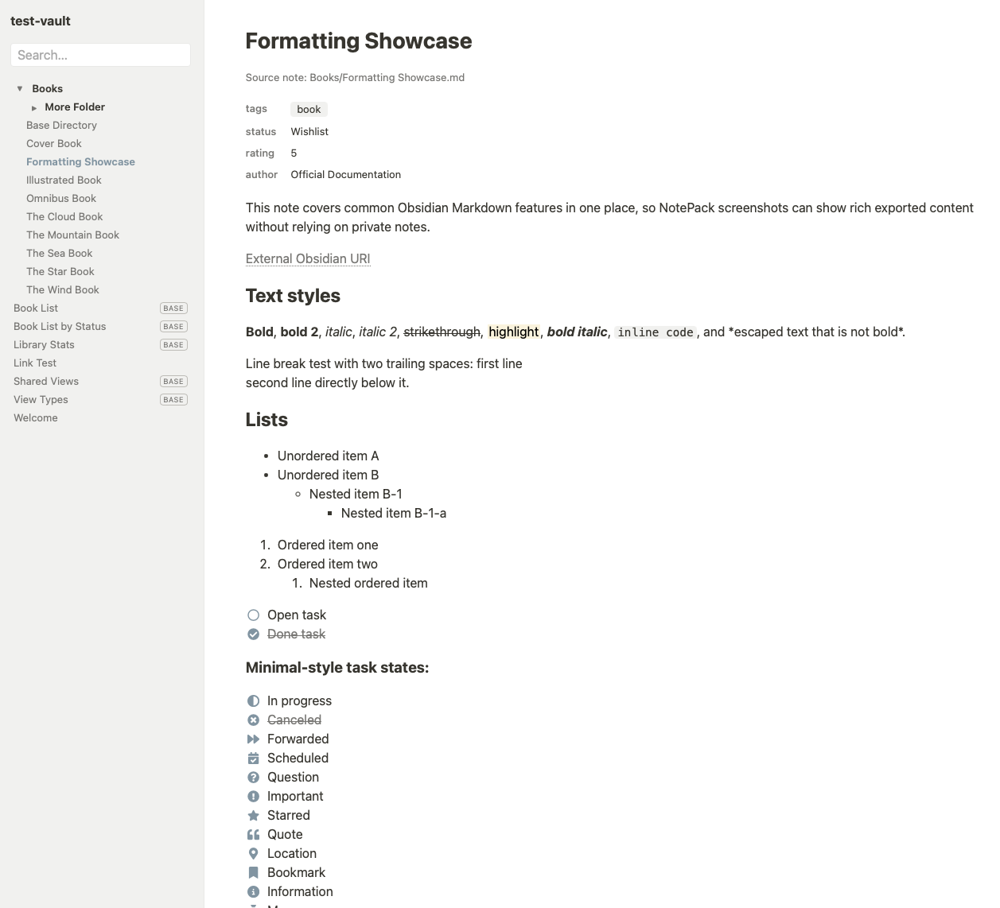
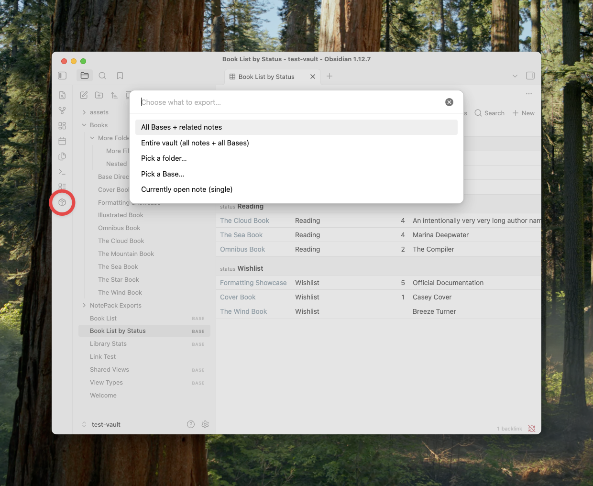

# VaultPack for Obsidian

[繁體中文](README.zh-TW.md) | [日本語](README.ja.md)

Export selected Obsidian content — **including Bases views** — to a self-contained, offline-readable static website. Share it as a plain folder,
an AES-encrypted ZIP, or upload it to any ordinary web host, optionally behind a password.



## Features

- **Bases, exported for real** — root `.base` pages and `![[File.base#View]]`
  embeds (with `this`-context evaluation), named views, groups, formula
  columns, `displayName` headers, summaries (totals + per-group), table /
  list / cards views with cover images.
- **Five output modes**

| Mode | What you get |
|---|---|
| Local folder | a normal offline folder — open `START_HERE.html` |
| Encrypted ZIP | AES-256 archive (password required before extraction) |
| Web: Public | uploadable folder, indexable by search engines |
| Web: Link-only | unguessable folder name, `noindex` everywhere, no referrer leakage — "anyone with the link" sharing |
| Web: Password | a generated PHP login gate (bcrypt, sessions, path-traversal safe) for ordinary Apache/PHP shared hosting, with a built-in host self-check page |

- **Publish-style sidebar** — package title, offline full-text search, and a
  collapsible folder/file tree (real folder structure, `BASE` badges,
  current-page highlight); collapses to a menu button on mobile.
- **Faithful note pages** — properties block, callouts, footnotes, Mermaid,
  MathJax (converted to self-contained SVG), task lists with 22 states
  rendered as Font Awesome icons, code blocks with an offline copy button.
- **Zero-dependency output** — every page works from `file://`, no CDN, no
  fonts to fetch, no framework. Design tokens (CSS custom properties) make
  re-theming a single-file edit.
- **Multilingual** — UI and exported pages follow the Obsidian app language:
  Traditional Chinese (zh-TW), English, Japanese; anything else falls back to
  English.
- **Safe by construction** — never modifies your notes; every export is a
  brand-new timestamped folder; filenames are opaque ASCII hashes (your note
  titles never leak into URLs); `obsidian://` deep links are stripped from
  shared output.



## Usage

- Ribbon **package** icon, or `Export (choose scope)...` from the command
  palette -> pick a scope (all Bases / entire vault / a folder / one Base /
  the open note) -> pick an output mode -> optionally set a custom title.
- Right-click a folder, or use the `...` menu on a note / Base, to export just
  that item.
- Folder exports automatically include the Bases embedded by the selected
  notes, wherever those `.base` files live.



### Password mode in 30 seconds

Upload the whole exported folder to your host. Opening the folder URL shows a
login page; run the **self-check** link at the bottom first — it verifies the
host actually blocks direct access to the private folder before you share the
link. Requires Apache with `.htaccess` + `mod_rewrite` and PHP sessions
(typical WordPress-grade shared hosting).

> **Security model, honestly:** Link-only mode reduces discoverability; it is
> not access control. Password mode gates web access; it does not encrypt
> files at rest and does not protect content from the hosting provider.
> The encrypted ZIP protects the archive — extracted files are normal files.

## Settings

- Include diagnostics files in web packages (off by default)
- High-entropy folder names for link-only/password exports (on by default)
- Developer mode — extra self-test commands (off by default)
- "Remember me" session lifetime for password mode (default 30 days)

Exported links and task icons follow your Obsidian **accent color**
(captured at export time).

## Network use (disclosure)

VaultPack makes network requests **only during an export**, and only to build
offline embed cards for external content found in your notes:

- `youtube.com/oembed` + the video thumbnail (bundled into the package)
- `publish.twitter.com/oembed` for tweets

No telemetry, no analytics; nothing about your vault is transmitted anywhere.
Exports work offline too — external embeds then degrade to plain link cards.

## Requirements

- Obsidian **1.13+** (Bases), desktop only (uses the desktop rendering
  pipeline and file-system adapter).

## Development

```bash
npm install
npm run build   # type-check + bundle main.js
```

The repository ships a checker (`scripts/check-export.mjs` in the parent
project) and headless test harnesses under `test-harness/`.

## Credits & license

- Plugin code: MIT (see `LICENSE`).
- Checkbox icons: [Font Awesome Free](https://fontawesome.com) by
  @fontawesome, icons licensed
  [CC BY 4.0](https://fontawesome.com/license/free) — bundled as static SVG
  path data in `src/checkbox-icons.ts`.
